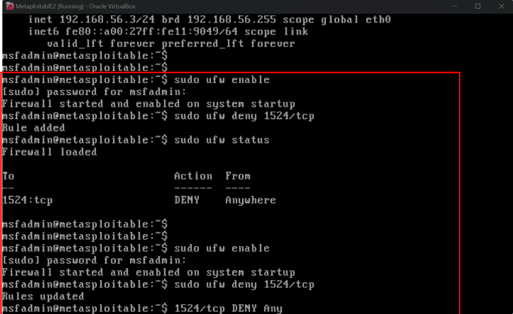

# Day 12: Red Team vs Blue Team - Firewall Lockout

**Role**: Red Team + Blue Team 
**Target**: Metasploitable2 `192.168.56.3` 
**Date**: 2026-06-28 
**Challenge**: #100ayCybersecurityChallenge Day 12

---

### **1. Objective**
Attack a vulnerable Metasploitable2 VM via the `bindshell` backdoor on TCP/1524 to gain root. 
Then switch to Blue Team, block the port with UFW, and validate the defense by confirming self-lockout.

### **2. Lab Environment**
| Component | Detail |
| --- | --- |
| **Target VM** | Metasploitable2 `192.168.56.3` - NAT/Host-Only Network |
| **Attacker VM** | Kali Linux `192.168.56.4` |
| **Tools** | `nmap`, `netcat nc`, `ufw`, `nmap --script vuln` |
| **Vulnerable Service** | `1524/tcp bindshell Metasploitable root shell` |

### **3. Methodology & Evidence**

#### **Phase 1: Reconnaissance - Red Team**
Full service scan to map the attack surface and identify the backdoor port.

sudo nmap -sV -sC -O -T4 192.168.56.3
 
_Fig 1: Full Recon - `nmap -sV` mapped 20+ open ports. Target identified: `1524/tcp open bindshell Metasploitable root shell`_

*Key Finding*: `1524/tcp` = unauthenticated root shell. Also found `vsftpd 2.3.4` + `Samba 3.0.20` for alternate paths.

#### *Phase 2: Exploitation - Red Team*
Connected directly to the bindshell with no authentication required.
nc 192.168.56.3 1524
 
_Fig 2: Exploit Success - `nc 192.168.56.3 1524` gave instant `root@metasploitable:/#` via T1190_

*Result*: Root access gained in <3 seconds. MITRE T1190 - Exploit Public-Facing Application.

*Alternate Finding*: `nmap --script vuln` also confirmed `vsFTPD 2.3.4 backdoor CVE-2011-2523` = RCE as `uid=0(root)`.

#### *Phase 3: Hardening - Blue Team*
Enabled UFW and blocked the exploited port to simulate incident response.
sudo ufw enable
sudo ufw deny 1524/tcp
sudo ufw status verbose
 
_Fig 3: Defense - `sudo ufw deny 1524/tcp` applied. Status confirms `1524:tcp  DENY  Anywhere` = T1562.004_

#### *Phase 4: Validation - Blue Team Test*
Retested the exploit from Kali to confirm mitigation worked.
nc 192.168.56.3 1524
 
_Fig 4: Validation - Left: Kali `nc` now times out. Right: Metasploitable shows `DENY` rule active. Attack vector closed._

*Result*: Connection blocked ✅, but remote access via 1524 is dead ❌ = Self-lockout.

### *4. Key Takeaways & Lessons Learned*
1.  *Scan ➜ Exploit ➜ Harden ➜ Validate*: This is the full Red/Blue Team loop in one lab.
2.  *Default Backdoors = Critical*: `1524/tcp bindshell` in Metasploitable2 requires 0 auth. Patch/remove in prod.
3.  *Firewalls Work Fast*: `ufw deny` immediately mitigated T1190 via T1562.004.
4.  *Avoid Self-DoS*: Blocking your only remote port without `ufw allow ssh` or a management IP = lock yourself out. 

### *5. MITRE ATT&CK Mapping*
Tactic | Technique | Technique ID | Description
**Initial Access** | Exploit Public-Facing Application | T1190 | Exploited bindshell on 1524/tcp for root
**Defense Evasion** | Impair Defenses: Firewall Rule | T1562.004 | Used `ufw deny` to block the attack vector
### *6. References*
1.  Metasploitable2 Exploitability Guide: https://docs.rapid7.com/metasploit/metasploitable-2-exploitability-guide/
2.  MITRE ATT&CK T1190: https://attack.mitre.org/techniques/T1190/
3.  MITRE ATT&CK T1562.004: https://attack.mitre.org/techniques/T1562/004/
4.  CVE-2011-2523 vsFTPD Backdoor: https://nvd.nist.gov/vuln/detail/CVE-2011-2523

---
*Tags*: #RedTeam #BlueTeam #SOC #UFW #Firewall #Metasploitable2 #Linux #Nmap #Netcat #EthicalHacking #LearningInPublic #30DayCybersecurityChallenge

### *Screenshot File Names Used*
screenshots/Day12-Full-Service-Scan.png
screenshots/Day12-Bindshell-Root-Access.png
screenshots/Day12-UFW-Deny-1524.png  
screenshots/Day12-Lockout-Proof-Final.png

**Why these 4 screenshots:** 
1.  `Full-Service-Scan` = Shows scope + how you found 1524 
2.  `Root-Access` = Proves the exploit worked 
3.  `UFW-Deny-1524` = Proves Blue Team action 
4.  `Lockout-Proof-Final` = Proves defense worked + the consequence

Drop those 4 `.png` files into a `screenshots/` folder and you’re done. 

Want me to add the `vsFTPD` vuln as a 5th screenshot section too?
