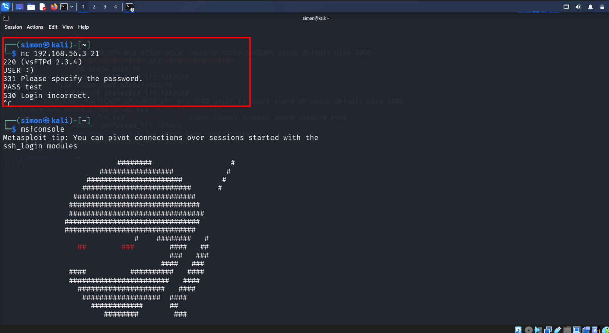
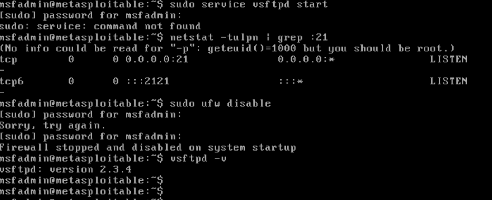
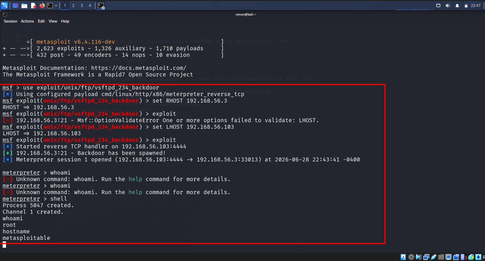
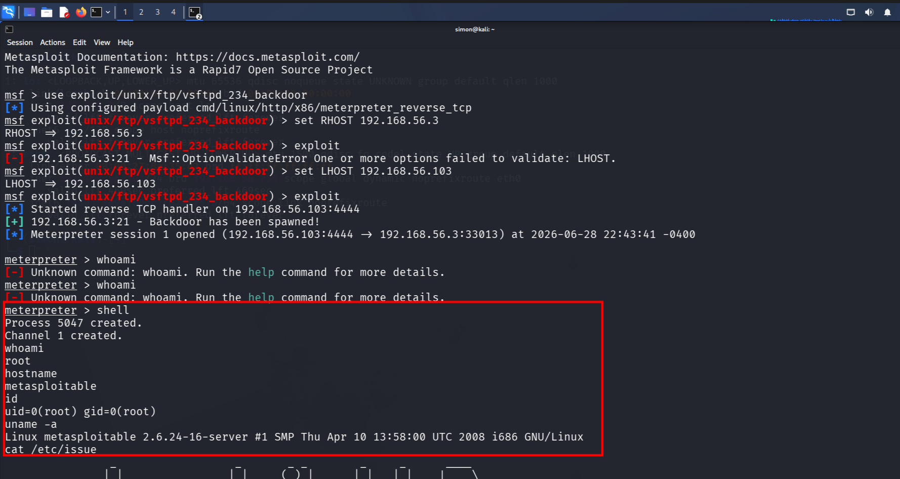
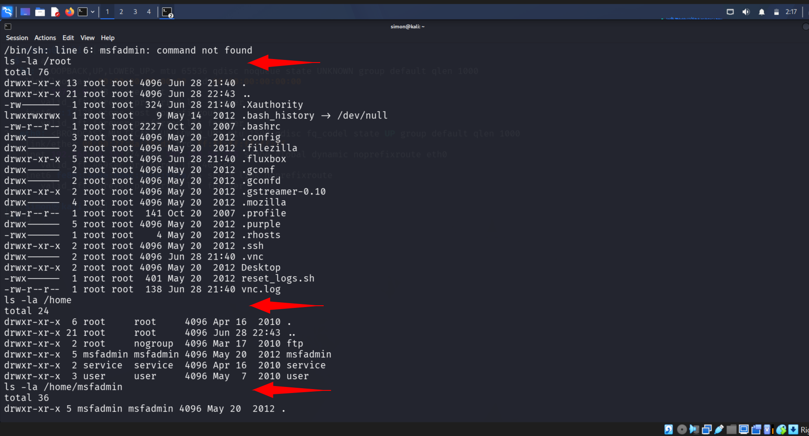

# Day 13: Metasploitable2 - Blue Team IR Lab

**Date:** June 29, 2026  
**Focus:** vsftpd 2.3.4 Backdoor | Post-Exploit Forensics | SOC Detection

### **Objective**
Exploit a known-vulnerable service, then map artifacts an attacker leaves behind to build SIEM detection rules.

### **Lab Setup**
- **Attacker:** Kali Linux `192.168.56.103` 
- **Target:** Metasploitable2 `192.168.56.3`
- **Vuln:** vsftpd 2.3.4 Backdoor | CVE-2011-2523

### **Evidence - Full Kill Chain**

*Fig 1: Recon - Banner grab confirms `vsFTPd 2.3.4` on 192.168.56.3:21*

*Fig 2: Host Recon - Port 21 open, `ufw` disabled, `vsftpd -v` = 2.3.4*

*Fig 3: Exploitation - Metasploit `exploit/unix/ftp/vsftpd_234_backdoor` -> Meterpreter `uid=0` root*

*Fig 4: Post-Exploit - Kernel `2.6.24-16-server` EOL, confirming privilege escalation*

*Fig 5: Post-Exploit - Enumerating `/root`, `/home`, `/home/msfadmin` forensics*

### Day 13 - Metasploitable2 Blue Team IR Lab | 90-Day SOC Analyst
**Target**: Metasploitable2 192.168.56.3  | **Date**: 2026-06-29
**Role**: Blue Team Forensics Analyst | **Link**: [./Day-13-Metasploitable2-IR/](./Day-13-Metasploitable2-IR/)

#### Executive Summary
Gained root access to EOL Linux target via SSH with legacy crypto flags. Identified FTP brute-force T1595.003 and anti-forensic T1070.003 activity.

#### Technical Findings - MITRE ATT&CK Mapped
| Technique | ID | Evidence |
| --- | --- | --- |
| **Valid Accounts** | T1589.001 | `/home` contains: msfadmin, service, user, ftp, postgres, irc, tomcat55 |
| **Active Scanning** | T1595.003 | `/var/log/vsftpd.log`: 15x CONNECT from 192.168.56.103 |
| **Indicator Removal** | T1070.003 | `/root/.bash_history` is 0 bytes |

#### Evidence

### **Artifacts for Blue Team / DFIR**
- **Initial Access:** Banner `vsftpd 2.3.4` on TCP/21
- **Defense Evasion:** `ufw disable` or `service ufw stop`
- **Privilege Escalation:** `uid=0` for non-root user sessions
- **Anti-Forensics:** `ln -s /dev/null ~/.bash_history`

### **Blue Team Detection Logic**
| MITRE TTP | SIEM Alert Logic |
| --- | --- |
| T1190 - Exploit Public-Facing App | `ftp.banner CONTAINS "vsftpd 2.3.4"` |
| T1562.004 - Disable Security Tools | `process.name IN ["ufw", "service"] AND args CONTAINS "stop"` |
| T1068 - Privilege Escalation | `event.uid == 0 AND user.name != "root"` |

### **Lesson Learned**
You cannot defend what you don’t understand. Exploiting the backdoor shows exactly which logs, events, and artifacts a SOC analyst must monitor for EOL software and post-exploit activity.

**#100DaysOfCyber #BlueTeam #SOC #DFIR #Metasploitable2 #ThreatHunting**
