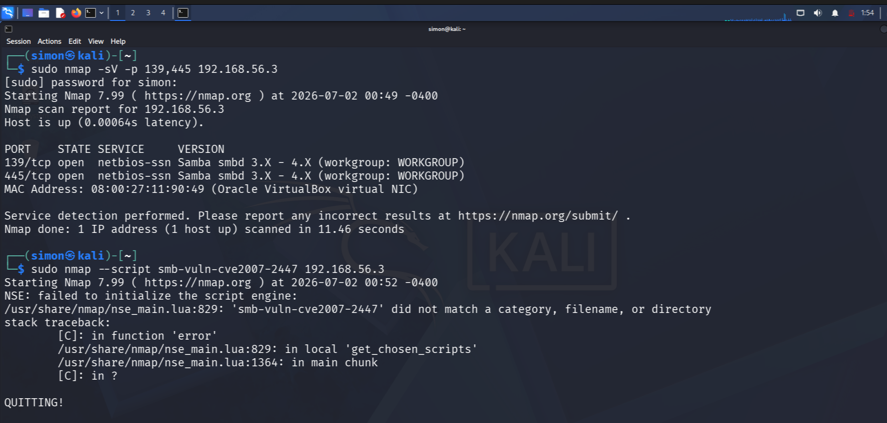
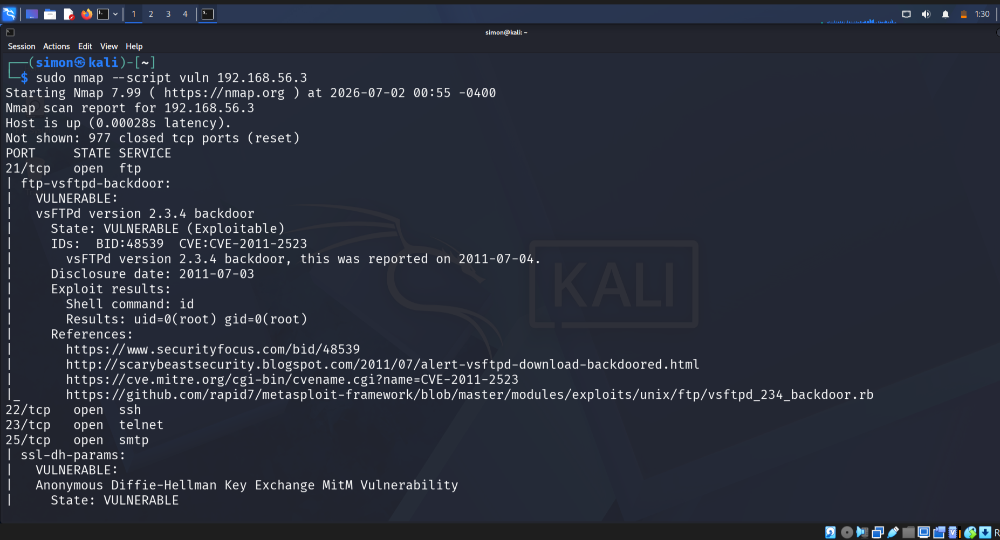
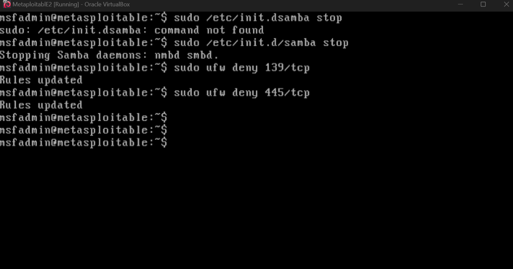
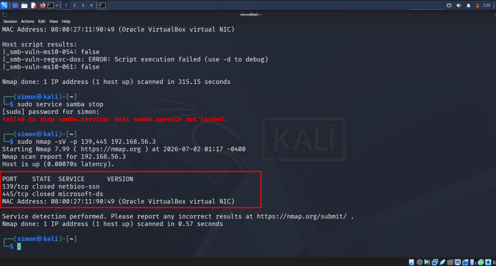

# Day 16: End-of-Life Service Hardening - vsFTPd 2.3.4 Backdoor

## 1. Objective
Identify, confirm, and mitigate a critical vulnerability in an End-of-Life `vsFTPd v2.3.4` FTP service on Metasploitable2. This simulates a Blue Team Incident Response workflow: Recon -> Vuln Confirmation -> Containment -> Validation.

**CVE**: CVE-2011-2523 | **Risk**: Remote Code Execution, Root Shell Access | **Target**: `192.168.56.3`

---

## 2. Incident Response Workflow

### Step 1: Service Recon
**Goal**: Identify open ports and confirm the EOL service/version is running.

sudo nmap -sV -p 21 192.168.56.3

*Finding*: `21/tcp open vsftpd 2.3.4`
`vsFTPd 2.3.4` is End-of-Life and contains a known backdoor.

Step 2: Vulnerability Confirmation
*Goal*: Actively verify the vulnerability is exploitable using NSE scripts.

sudo nmap --script vuln 192.168.56.3

*Finding*: `VULNERABLE: vsFTPd version 2.3.4 backdoor`
`State: VULNERABLE` and `uid=0(root)` confirms unauthenticated root access is possible.

Step 3: Hardening / Containment Actions
*Goal*: Immediately reduce the attack surface on the affected host `Metasploitable2`.

# 1. Stop the vulnerable service immediately
sudo /etc/init.d/vsftpd stop

# 2. Block the port at the host firewall
sudo ufw deny 21/tcp
sudo ufw enable

*Action Taken*: Service stopped + Firewall rule applied to deny all inbound TCP/21.

Step 4: Validation / Post-Remediation Scan
*Goal*: Verify from the attacker VM `Kali` that the service is no longer accessible.

sudo nmap -p 21 192.168.56.3

*Result*: `21/tcp filtered`
`filtered` confirms the host firewall `ufw` is now blocking the port. The vulnerability is contained.

---

## 4. Lessons Learned & Blue Team Notes
1.  **EOL = Remove, Don't Patch**: `vsFTPd 2.3.4` has no vendor patch. `CVE-2011-2523` is unfixable except by removing the package.
2.  **Network Segmentation**: In production, legacy services like FTP should be on isolated VLANs with strict firewall rules.
3.  **Defense-in-Depth**: `nmap --script vuln` is critical. Version detection alone is not proof of exploitability.
4.  **Validation is Mandatory**: An IR workflow is incomplete without a post-remediation scan to prove containment.

**Tools Used**: `Nmap`, `NSE vuln scripts`, `ufw`, `Metasploitable2`, `Kali Linux`  
**Category**: #VulnerabilityManagement #IncidentResponse #LinuxHardening #BlueTeam #CVE-2011-2523
