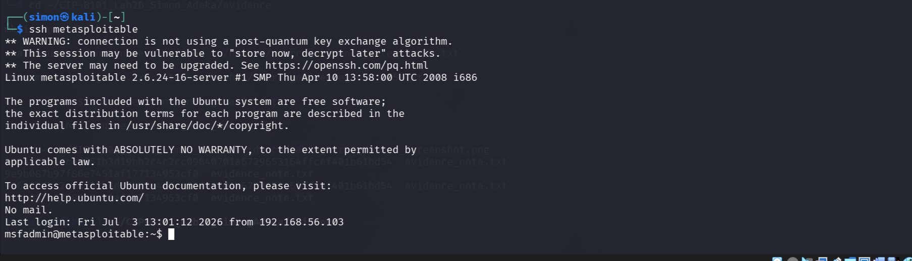
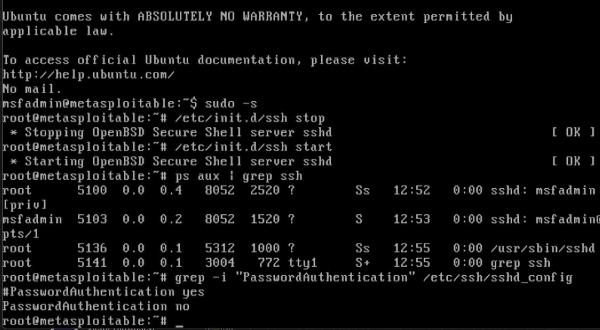

# SSH Hardening — Blue Team Control

##  Objective
Harden SSH on a legacy Metasploitable 2 target by disabling password authentication and enforcing public key authentication only, aligning with the **CIS Ubuntu Benchmark 5.2** standard.

> **Blue Team Purpose:** Implement and verify a CIS-aligned control that eliminates password-based SSH attacks, increases accountability, and provides auditable evidence of secure configuration.

---

## Environment Configuration
*   **Attacker/Operator Machine:** Kali Linux 2026.1 (`simon@kali`)
*   **Target Machine:** Metasploitable 2 (`msfadmin@192.168.56.3`)
*   **Target Service:** OpenSSH v4.7p1

---

##  Implementation Steps

### 1. Generate and Deploy SSH Key
Execute the following commands on the **Kali Linux** operator machine to generate a 2048-bit RSA key pair and copy the public key to the target:
```bash
# Generate the RSA key pair
ssh-keygen -t rsa -b 2048 -f ~/.ssh/metasploitable_key

# Copy the public key to the target machine
ssh-copy-id -i ~/.ssh/metasploitable_key.pub msfadmin@192.168.56.3
```

### 2. Harden File Permissions on Target
Access the **Metasploitable 2** target and strictly restrict access to the SSH directory and keys:
```bash
# Restrict directory access to owner-only
chmod 700 ~/.ssh

# Restrict file access to owner-only
chmod 600 ~/.ssh/authorized_keys
```

### 3. Disable Password Authentication
Modify the server configuration file (`/etc/ssh/sshd_config`) on **Metasploitable 2** to enforce cryptographic authentication:

```text
PubkeyAuthentication yes
PasswordAuthentication no
```
Restart the SSH daemon to apply the hardening controls:
```bash
sudo /etc/init.d/ssh restart
```

### 4. Handle Legacy Algorithm Compatibility
Because OpenSSH 4.7 utilizes deprecated cryptographic standards, modern Kali instances require explicit SSH client overrides. Configure the local configuration file (`~/.ssh/config`) on **Kali**:

```text
Host metasploitable
    HostName 192.168.56.3
    User msfadmin
    IdentityFile ~/.ssh/metasploitable_key
    HostKeyAlgorithms +ssh-rsa
    PubkeyAcceptedAlgorithms +ssh-rsa
    PasswordAuthentication no
```

---

##  Verification & Evidence

### Success: Public Key Authentication Works
Establishing a connection using the configured host profile bypasses the password prompt entirely:
```bash
\$ ssh metasploitable
msfadmin@metasploitable:~\$ 
```


### Success: Password Authentication Blocked
Attempting to force traditional password authentication is strictly dropped by the hardened server daemon:
```bash
\$ ssh -o PasswordAuthentication=yes msfadmin@192.168.56.3
Permission denied (publickey).
```

---

##  Blue Team Impact Analysis

| Control | Mitigated Risk | Security Value |
| :--- | :--- | :--- |
| **`PasswordAuthentication no`** | Brute-force, password spraying, credential stuffing. | Removes the primary vector for automated credential attacks. |
| **`PubkeyAuthentication yes`** | Unauthorized remote access. | Forces cryptographic authentication; requires private key compromise to breach. |
| **File Permission Hardening** | Privilege escalation, local key tampering. | Prevents local malicious actors or compromised service accounts from tampering with authorized keys. |
| **Key-Only Access** | Log pollution, alert fatigue. | Enhances SIEM log fidelity. Auth logs capture explicit public key fingerprints, easing audit trails. |

>  **Key Takeaway:** This represents a foundational host-hardening control. Eliminating the password vector effectively neutralizes external entry attempts prior to deploying layer-two defensive tools like `fail2ban`, port knocking, or Multi-Factor Authentication (MFA).
