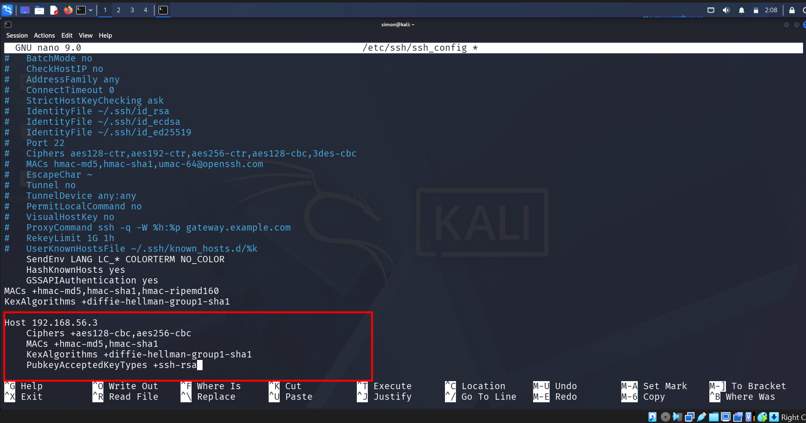
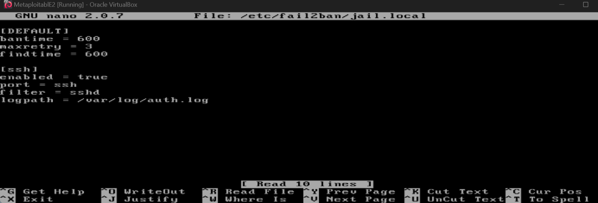
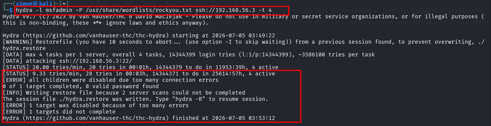
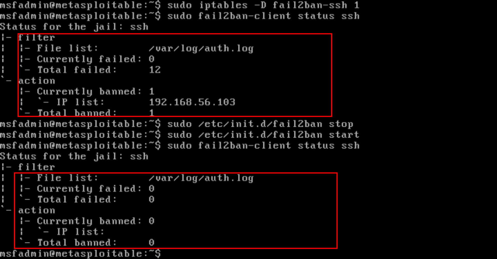
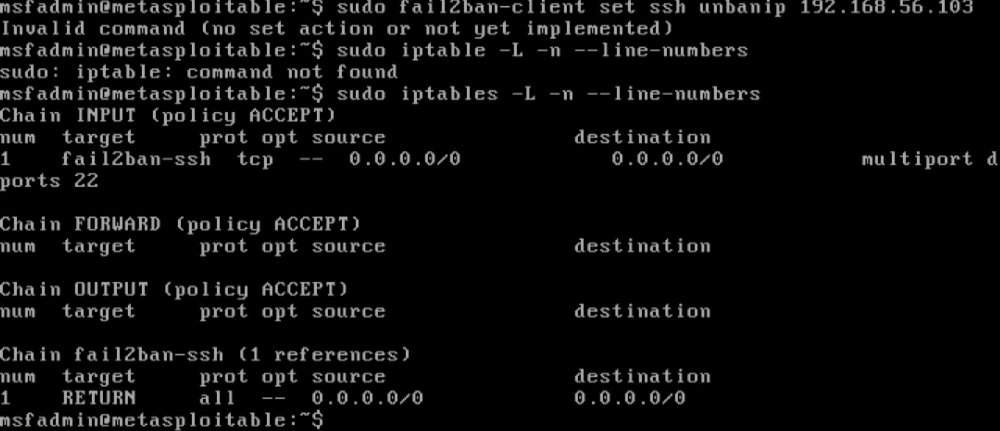

# Day 19: Fail2ban + iptables SSH Defense

## 1. Objective
Harden SSH on Metasploitable2 using Fail2ban and iptables to automatically detect and ban brute-force attacks.

## 2. Tools & Environment
- **Target**: Metasploitable2 `192.168.56.3`
- **Attacker**: Kali Linux `192.168.56.103`
- **Tools**: Fail2ban, iptables, Hydra, sshd

### Prerequisites
Kali needed custom SSH config to connect to Metasploitable2's old SSH:


## 3. Jail Settings
Configure the sshd jail in `/etc/fail2ban/jail.local`:



## Commands Used
1. Installation & Configuration
```bash
# Install fail2ban
sudo apt update && sudo apt install fail2ban -y

# Configure jail.local
# Copy default config to create local override
sudo cp /etc/fail2ban/jail.conf /etc/fail2ban/jail.local
```

3. Service Management & Attack Simulation
```
bash
# Restart and enable service
sudo systemctl restart fail2ban
sudo systemctl enable fail2ban

# Execute attack from Kali Linux machine
hydra -l msfadmin -P rockyou.txt ssh://192.168.56.3
```


4. Verification & Status Check
```
bash
# Check overall fail2ban status
sudo fail2ban-client status

# Check specific sshd jail status and see banned IPs
sudo fail2ban-client status sshd

# View active kernel firewall rules blocking attacker
sudo iptables -L -n -v
```


5. Defensive Admin Commands (Unbanning)
```
bash
# Unban a specific IP from sshd jail
sudo fail2ban-client set sshd unbanip 192.168.56.103
# Unban IP from all active jails
sudo fail2ban-client set sshd unbanip 192.168.56.103
```


##  MITRE ATT&CK Mapping
- Tactic: Credential Access (TA0006)
- Technique: Brute Force (T1110)
- Sub-technique: Password Guessing (T1110.001)
- Mitigation: Account Use Policies (M1036) via fail2ban connection limits.

