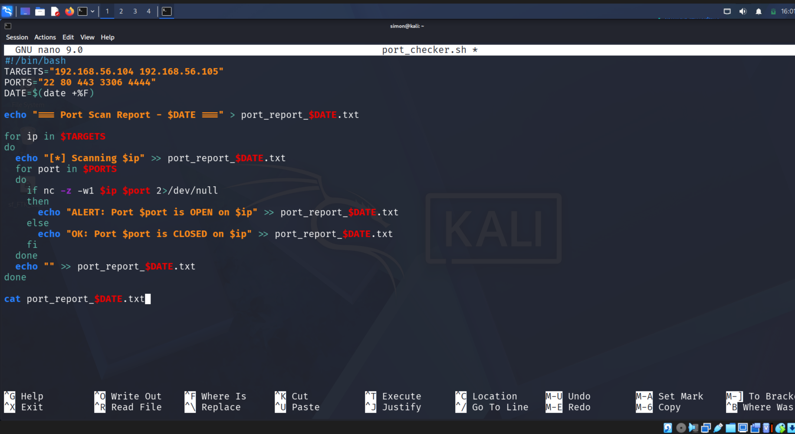
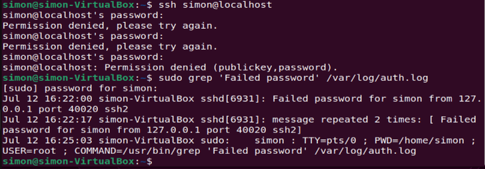

# Day25-Automation in Cybersecurity: Making security scalable

## 🎯 Objective
Automate security tasks to improve efficiency and scalability in a SOC environment.

## 🛠️ Tools Used
- **Kali Linux** - Attacker machine: `192.168.56.103`
- **Ubuntu** - Target machine: `192.168.56.101`
- **Python** - Scripting language for automation
- **Bash** - Scripting language for automation

## 📋 Steps Performed
### 1. Automated Port Scan + Report
Used a Bash script to scan critical ports on lab machines daily.

#!/bin/bash
# Automated port checker for SOC
TARGETS="192.168.56.104 192.168.56.105"
PORTS="22 80 443 3306 4444"
DATE=$(date +%F)
echo "=== Port Scan Report - $DATE ===" > port_report_$DATE.txt
for ip in $TARGETS
do
  echo "[*] Scanning $ip" >> port_report_$DATE.txt
  for port in $PORTS
  do
    if nc -z -w1 $ip $port 2>/dev/null
    then
      echo "ALERT: Port $port is OPEN on $ip" >> port_report_$DATE.txt
    else
      echo "OK: Port $port is CLOSED on $ip" >> port_report_$DATE.txt
    fi
  done
  echo "" >> port_report_$DATE.txt
done
echo "Report saved: port_report_$DATE.txt"

### 2. Parse Auth Logs for Failed Logins
Used a Python script to parse /var/log/auth.log for brute force attempts.

import re
from collections import Counter
log_file = "/var/log/auth.log"
failed_ips = []
with open(log_file, "r") as f:
  for line in f:
    if "Failed password" in line:
      ip = re.findall(r'from (\d+\.\d+\.\d+\.\d+)', line)
      if ip:
        failed_ips.append(ip[0])
counts = Counter(failed_ips)
print("=== Top 5 IPs with Failed Logins ===")
for ip, count in counts.most_common(5):
  print(f"{ip}: {count} attempts")
if counts:
  print("\n[ALERT] Possible brute force detected")

## 🔑 Key Learnings
1. *Automation improves efficiency*: Turns a 2-hour manual job into a 30-second cron job.
2. *Python is powerful for log analysis*: Easily parse and analyze log files.
3. *Bash is useful for simple tasks*: Quickly automate simple tasks like port scanning.

## ⚠️ Disclaimer
This was performed in a controlled lab environment. Do not use these techniques on systems without explicit permission.

### Progress
*Day 25/100 of #100DaysOfCyber*

Connect with me on https://www.linkedin.com/in/simon-adeka/

