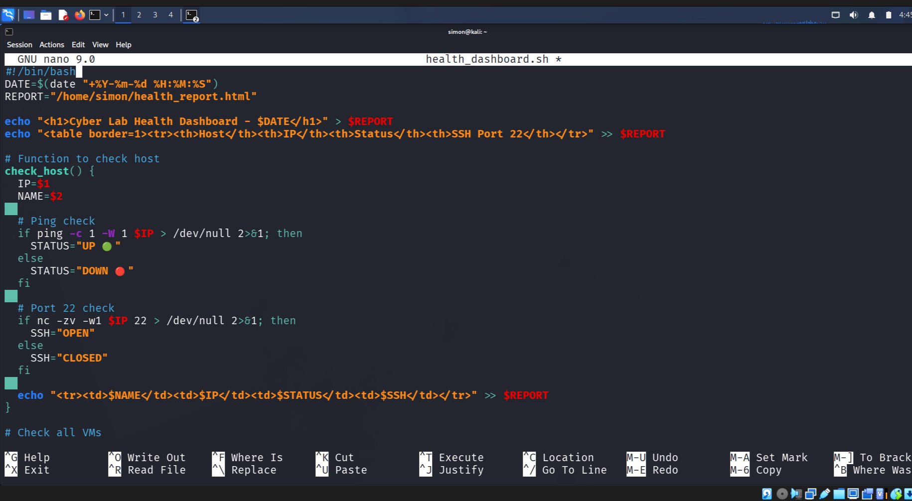
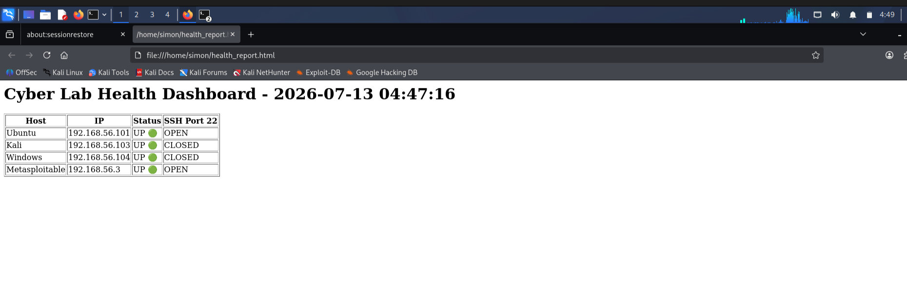

## 🎯 Objective
Build a bash script that automates daily health checks across all VMs in my cyber lab.
Goal: Go from 15 minutes of manual checks to a 10-second automated HTML dashboard.

## 🖥️ Lab Environment
| Host | IP | Role |
| --- | --- | --- |
| Ubuntu Server | 192.168.56.101 | Target Server |
| Kali Linux | 192.168.56.103 | Attacker / Automation Host |
| Windows 10 | 192.168.56.104 | Target |
| Metasploitable 2 | 192.168.56.3 | Vulnerable Target |

## ⚙️ The Automation Script: `health_dashboard.sh`
```bash
#!/bin/bash
DATE=$(date "+%Y-%m-%d %H:%M:%S")
REPORT="/home/simon/health_report.html"

echo "<h1>Cyber Lab Health Dashboard - $DATE</h1>" > $REPORT
echo "<table border=1><tr><th>Host</th><th>IP</th><th>Status</th><th>SSH Port 22</th></tr>" >> $REPORT

# Function to check host
check_host() {
IP=$1
NAME=$2

# Ping check
if ping -c 1 -W 1 "$IP" > /dev/null 2>&1; then
STATUS="UP 🟢"
else
STATUS="DOWN 🔴"
fi

# SSH Port check
if nc -zv -w1 "$IP" 22 > /dev/null 2>&1; then
SSH="OPEN"
else
SSH="CLOSED"
fi

# Write row to HTML
echo "<tr><td>$NAME</td><td>$IP</td><td>$STATUS</td><td>$SSH</td></tr>" >> $REPORT
}

# Run checks for all hosts
check_host 192.168.56.101 "Ubuntu"
check_host 192.168.56.103 "Kali"
check_host 192.168.56.104 "Windows"
check_host 192.168.56.3 "Metasploitable"

echo "</table>" >> $REPORT
echo "Report generated: $REPORT"

🚀 How to Run
1. Create the script and make it executable

nano health_dashboard.sh

Paste the code above, then:

chmod +x health_dashboard.sh



2. Run the health check

./health_dashboard.sh


3. View the dashboard

firefox /home/simon/health_report.html


📸 Final Dashboard Preview

_Green = UP / OPEN | Red = DOWN / CLOSED_

🧠 Key Learning
- Bash scripting for SOC automation
- Network monitoring with `ping` and `netcat`
- Generating dynamic HTML reports from shell
- Automating repetitive analyst work

📂 Folder Structure

100DaysOfCyber/
├── screenshots/
│ └── Day28_dashboard_screenshot.png
└── Day28/
├── health_dashboard.sh
├── health_report.html
└── README.md

🛠️ Tech Used
`Bash` `Linux` `ping` `netcat` `HTML`

#100DaysOfCyber #SOC #Automation #Bash
