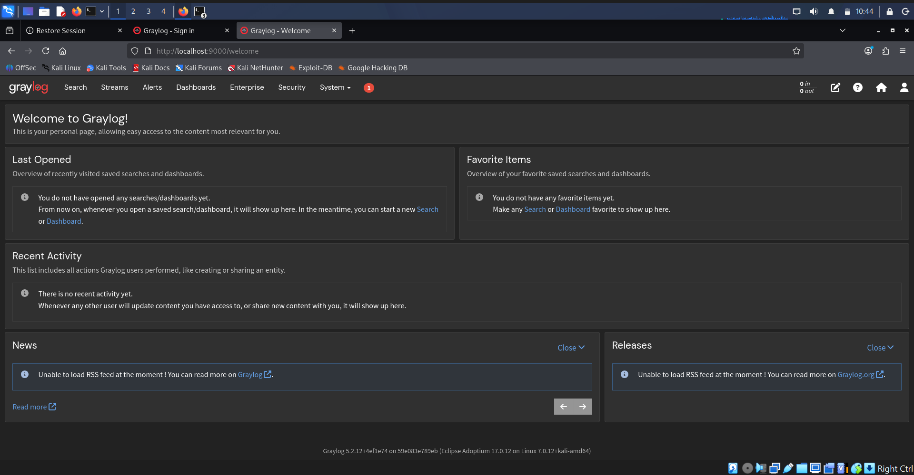
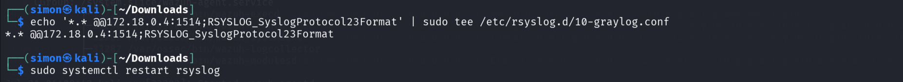
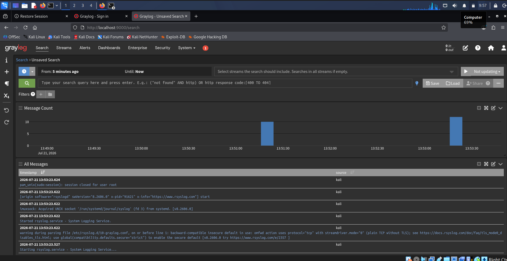

# 🚀 Day-31: Graylog SIEM Lab

A self-hosted SIEM lab built on Kali Linux using Docker and Graylog for centralized log monitoring and security analysis.

**Part of:** [100DaysOfCyber](https://github.com/Simonadeka/100DaysOfCyber)

---

## 📌 Lab Overview
In this lab, I deployed a Graylog SIEM stack using Docker and configured Kali Linux to forward all system and authentication logs in real-time. This simulates how a SOC monitors sudo usage, logins, and potential privilege escalation attempts.

## 🏆 Achievements
- [x] Successfully deployed Graylog + OpenSearch + MongoDB using Docker Compose
- [x] Configured rsyslog to forward logs from Kali to Graylog over TCP 1514
- [x] Parsed and visualized sudo authentication events in real-time
- [x] Tested 3 VirtualBox network modes: NAT, Bridged, Host-Only
- [x] Documented entire setup with screenshots and troubleshooting steps
- [x] Learned Docker networking and log aggregation for SOC workflows

## 🛠️ Tech Stack
- **OS**: Kali Linux 2025
- **SIEM**: Graylog 5.2
- **Containerization**: Docker & Docker Compose
- **Database**: MongoDB 6.0, OpenSearch 2.11
- **Log Forwarder**: rsyslog

---

## 🚀 Setup Instructions

### 1. Clone and Start Graylog with Docker

git clone https://github.com/Simonadeka/graylog-siem-lab
cd graylog-siem-lab
docker compose up -d

2. Configure Graylog Input
1. Go to `http://localhost:9000`
2. Login: `admin / admin`
3. `System > Inputs > Launch new input > Syslog TCP`
4. *Port*: `1514` | *Bind address*: `0.0.0.0`

### 3. Configure Kali to Forward Logs
```bash
sudo apt install rsyslog -y
echo '*.* @@192.168.56.101:1514;RSYSLOG_SyslogProtocol23Format' | sudo tee /etc/rsyslog.d/10-graylog.conf
sudo systemctl restart rsyslog
```

### 4. Test Log Forwarding
```bash
logger -n 192.168.56.101 -P 1514 -T "Test log from Kali"
sudo ls /root
```
Then check `Graylog > Search` for incoming logs.

---

## 📸 Screenshots

### 1. Graylog Dashboard

*Real-time capture of sudo session opened/closed events*

### 2. Kali rsyslog Configuration  

*rsyslog forwarding all logs to Graylog server*

### 3. Logs in Graylog Search

*Graylog parsing and indexing Kali system logs*
---
### 3. Copy this `docker-compose.yml`
```yaml
version: '3'
services:
  mongo:
    image: mongo:6.0
    volumes:
      - mongo_data:/data/db

  opensearch:
    image: opensearchproject/opensearch:2.11.1
    environment:
      - discovery.type=single-node
      - "OPENSEARCH_JAVA_OPTS=-Xms1g -Xmx1g"
    ulimits:
      memlock:
        soft: -1
        hard: -1
    volumes:
      - opensearch_data:/usr/share/opensearch/data

  graylog:
    image: graylog/graylog:5.2
    environment:
      - GRAYLOG_PASSWORD_SECRET=somepasswordpepper
      - GRAYLOG_ROOT_PASSWORD_SHA2=8c6976e5b5410415bde908bd4dee15dfb167a9c873fc4bb8a81f6f2ab448a918
      - GRAYLOG_HTTP_EXTERNAL_URI=http://localhost:9000/
    depends_on:
      - mongo
      - opensearch
    ports:
      - "9000:9000"
      - "1514:1514/tcp"
    volumes:
      - graylog_data:/usr/share/graylog/data

volumes:
  mongo_data:
  opensearch_data:
  graylog_data:
```
📚 What I Learned
- Deploying enterprise SIEM tools in a containerized environment
- Configuring rsyslog for remote TCP syslog forwarding
- Troubleshooting Docker networking: NAT vs Bridged vs Host-Only
- Log parsing, stream routing, and basic SOC monitoring workflows

🔮 Future Improvements
- [ ] Add TLS encryption for syslog traffic
- [ ] Create Graylog Alerts for failed SSH logins
- [ ] Integrate with Wazuh for IDS/IPS correlation
- [ ] Forward logs from Windows and other Linux VMs

👤 Author
*Simon Friday Adeka*
Cybersecurity & Digital Forensics Intern | SOC Analyst in Training
https://github.com/Simonadeka | https://www.linkedin.com/in/simon-adeka/

📄 License
MIT License


