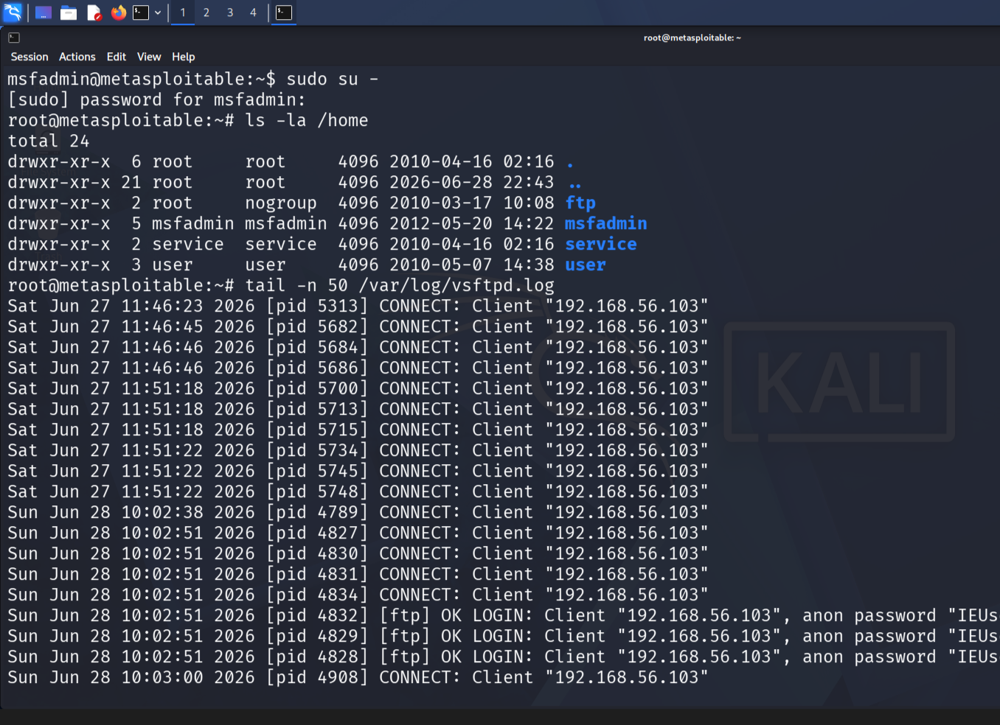
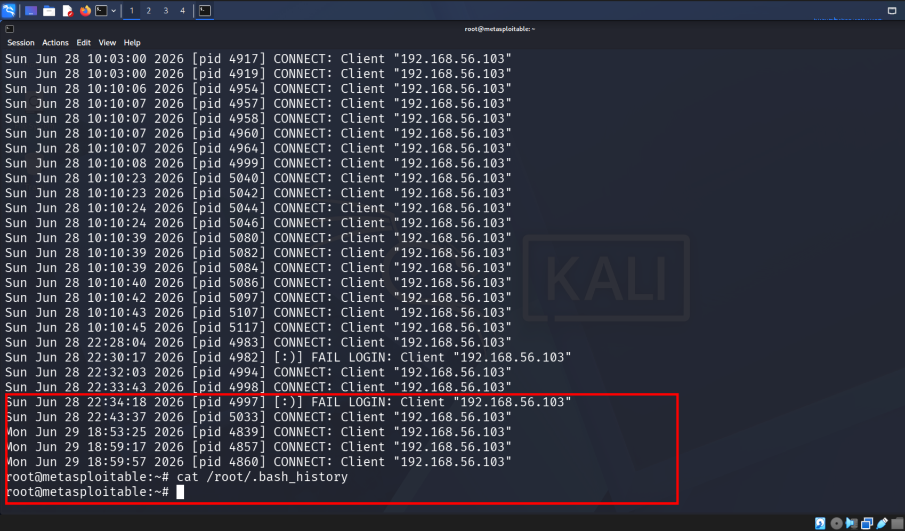

# 🔒 100DaysOfCyber - Home Lab Journey

## **Goal**
Document my transition into Cybersecurity by breaking and defending `Metasploitable2`.
Red Team → Blue Team. Scan → Exploit → Harden → Verify.

## **Why**
If you can't break it, you can't protect it. This repo is proof of work for SOC/Blue Team roles.

## **Lab Setup**
**Target:** `Metasploitable2` on VirtualBox | **Attacker:** `Kali Linux`
**Tools:** `nmap`, `nc/netcat`, `ufw`, `msfconsole`

---

## **Table of Progress**
Click any Day to jump 👇 Update `⬜` to `✅` as you go.

| Day | Title | Skills | Link | Status |
| --- | --- | --- | --- | --- |
| Day 1 | Nmap Basics | Host Discovery, Port Scanning | [Link](./Day-1-Nmap/) | ✅ |
| Day 2 | Hydra FTP Bruteforce | Weak Credential Attack | [Link](./Day-2-Hydra-FTP/) | ✅ |
| Day 3 | SMB Share Enum | SMB Enumeration | [Link](./Day-3-SMB/) | ✅ |
| Day 4 | SSH Bruteforce | Hydra, SSH | [Link](./Day-4-SSH/) | ✅ |
| Day 5 | Web Dir Bruteforce | Gobuster, Dirb | [Link](./Day-5-Web-Dir/) | ✅ |
| Day 6 | vsftpd 2.3.4 Backdoor | FTP Backdoor Exploit | [Link](./Day-6-vsftpd/) |  |
| Day 7 | Samba usermap_script RCE | RCE Exploit | [Link](./Day-7-Samba/) |  |
| Day 8 | UnrealIRCd Backdoor | IRC Backdoor | [Link](./Day-8-UnrealIRCd/) |  |
| Day 9 | Distcc RCE | Distcc Exploit | [Link](./Day-9-Distcc/) |  |
| Day 10 | VNC Auth Bypass | VNC Weak Auth | [Link](./Day-10-VNC/) |  |
| Day 11 | PostgreSQL Weak Creds | DB Creds Bruteforce | [Link](./Day-11-Postgres/) |  |
| Day 12 | MySQL Weak Creds | DB Creds Bruteforce | [Link](./Day-12-MySQL/) |  |
| Day 13 | Metasploitable2 - Blue Team IR Lab | vsftpd 2.3.4 Backdoor, Post-Exploit Forensics | [Link](./Day-13-Metasploitable2-IR/) | ✅ |
| Day 14 | Hydra SSH Bruteforce |  |  |  |
| Day 15 | Hydra FTP Bruteforce |  |  |  |
| Day 16 | Web App: DVWA Setup |  |  |  |
| Day 17 | SQL Injection DVWA |  |  |  |
| Day 18 | XSS Reflected DVWA |  |  |  |
| Day 19 | File Upload DVWA |  |  |  |
| Day 20 | Command Injection DVWA |  |  |  |
| Day 21 | Nmap Scripting Engine NSE | ⬜ |
| Day 22 | SMB Enum + Null Sessions | ⬜ |
| Day 23 | SNMP Enum | ⬜ |
| Day 24 | DNS Zone Transfer | ⬜ |
| Day 25 | Nikto Web Scan | ⬜ |
| Day 26 | Burp Suite Intro | ⬜ |
| Day 27 | Gobuster Dir Bruteforce | ⬜ |
| Day 28 | John the Ripper Cracking | ⬜ |
| Day 29 | Hashcat Basics | ⬜ |
| Day 30 | Wireshark Traffic Analysis | ⬜ |
| Day 31 | Log Analysis: auth.log | ⬜ |
| Day 32 | Firewall Rules: UFW | ⬜ |
| Day 33 | Fail2Ban Setup | ⬜ |
| Day 34 | SSH Hardening | [Link](./Day-13-Metasploitable2-IR/) | ✅ |
| Day 35 | IDS Intro: Snort | ⬜ |
| Day 36 | Splunk Free + Logs | ⬜ |
| Day 37 | Sysmon + Windows Events | ⬜ |
| Day 38 | Threat Hunting Basics | ⬜ |
| Day 39 | YARA Rules Intro | ⬜ |
| Day 40 | MITRE ATT&CK Mapping | ⬜ |
| Day 41 | Phishing Email Analysis | ⬜ |
| Day 42 | Maldoc Analysis Basics | ⬜ |
| Day 43 | Memory Forensics: Volatility | ⬜ |
| Day 44 | Disk Forensics: Autopsy | ⬜ |
| Day 45 | Network Forensics: PCAP | ⬜ |
| Day 46 | Incident Response Plan | ⬜ |
| Day 47 | Containment + Eradication | ⬜ |
| Day 48 | Recovery + Lessons Learned | ⬜ |
| Day 49 | SIEM Alert Tuning | ⬜ |
| Day 50 | SOC Playbook Day 1 | ⬜ |
| Day 51 | SOC Playbook Day 2 | ⬜ |
| Day 52 | Blue Team Labs: Blue Team 1 | ⬜ |
| Day 53 | Detection Engineering | ⬜ |
| Day 54 | Sigma Rules Intro | ⬜ |
| Day 55 | KQL / Splunk SPL | ⬜ |
| Day 56 | Osquery Basics | ⬜ |
| Day 57 | OSINT Fundamentals | ⬜ |
| Day 58 | Shodan + Censys | ⬜ |
| Day 59 | Recon-ng Framework | ⬜ |
| Day 60 | TheHarvester | ⬜ |
| Day 61 | Metasploit Basics | ⬜ |
| Day 62 | Metasploit Payloads | ⬜ |
| Day 63 | Pivoting + ProxyChains | ⬜ |
| Day 64 | Post-Exploitation | ⬜ |
| Day 65 | PrivEsc Linux | ⬜ |
| Day 66 | PrivEsc Windows | ⬜ |
| Day 67 | Kerberoasting | ⬜ |
| Day 68 | BloodHound Basics | ⬜ |
| Day 69 | Active Directory Basics | ⬜ |
| Day 70 | GPO Security | ⬜ |
| Day 71 | Cloud Security Intro: AWS | ⬜ |
| Day 72 | S3 Bucket Misconfig | ⬜ |
| Day 73 | Docker Security | ⬜ |
| Day 74 | Kubernetes Basics | ⬜ |
| Day 75 | IaC Security: Terraform | ⬜ |
| Day 76 | API Security Testing | ⬜ |
| Day 77 | JWT Attack Basics | ⬜ |
| Day 78 | GraphQL Testing | ⬜ |
| Day 79 | Mobile Security Intro | ⬜ |
| Day 80 | Threat Modeling STRIDE | ⬜ |
| Day 81 | Risk Assessment | ⬜ |
| Day 82 | Compliance: NIST CSF | ⬜ |
| Day 83 | Compliance: ISO 27001 | ⬜ |
| Day 84 | Purple Team Exercise 1 | ⬜ |
| Day 85 | Purple Team Exercise 2 | ⬜ |
| Day 86 | Report Writing | ⬜ |
| Day 87 | Executive Briefing | ⬜ |
| Day 88 | Resume + LinkedIn Update | ⬜ |
| Day 89 | Mock SOC Interview | ⬜ |
| Day 90 | Mock Red Team Report | ⬜ |
| Day 91 | CTF Day 1 | ⬜ |
| Day 92 | CTF Day 2 | ⬜ |
| Day 93 | CTF Day 3 | ⬜ |
| Day 94 | Bug Bounty Recon | ⬜ |
| Day 95 | Bug Bounty Reporting | ⬜ |
| Day 96 | Career Branding | ⬜ |
| Day 97 | Networking + Community | ⬜ |
| Day 98 | Portfolio Review | ⬜ |
| Day 99 | Final Lab Challenge | ⬜ |
| Day 100 | Final Report + Reflection | ⬜ |

---

### Day 13 - Metasploitable2 Blue Team IR Lab | 90-Day SOC Analyst
**Target**: Metasploitable2 192.168.56.3  | **Date**: 2026-06-29
**Role**: Blue Team Forensics Analyst | **Link**: [./Day-13-Metasploitable2-IR/](./Day-13-Metasploitable2-IR/)

#### Executive Summary
Gained root access to EOL Linux target via SSH with legacy crypto flags. Identified FTP brute-force T1595.003 and anti-forensic T1070.003 activity.

#### Technical Findings - MITRE ATT&CK Mapped
| Technique | ID | Evidence |
| --- | --- | --- |
| **Valid Accounts** | T1589.001 | `/home` contains: msfadmin, service, user, ftp, postgres, irc, tomcat55 |
| **Active Scanning** | T1595.003 | `/var/log/vsftpd.log`: 15x CONNECT from 192.168.56.103 |
| **Indicator Removal** | T1070.003 | `/root/.bash_history` is 0 bytes |

#### Evidence



#### SOC Analyst Takeaways
1.  **Legacy Assets = Risk**: EOL systems need deprecated crypto. Isolate them.
2.  **Correlate Logs**: Bash history was wiped, but vsftpd.log exposed the attack.
3.  **Host-Specific Flags**: Use `-o` flags per-host vs weakening global `~/.ssh/config`.

### **Day 1: Lab Setup + Nmap Baseline**
**Mindset:** You can’t attack what you can’t reach.
**What:** Built lab. Kali IP: `192.168.56.2` Target IP: `192.168.56.3`
```bash
nmap -sn 192.168.56.0/24
